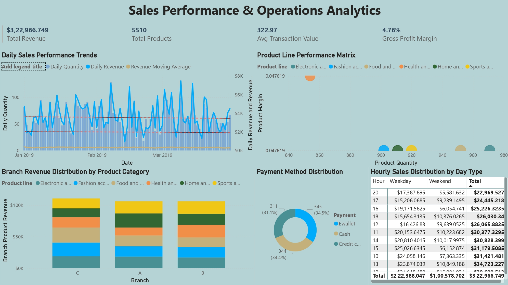
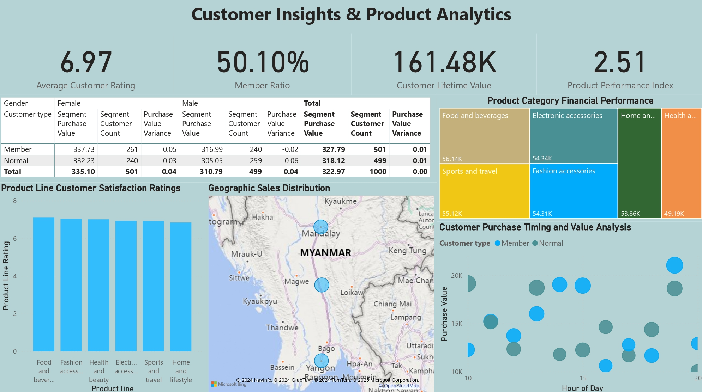

# Supermarket Sales Analytics Dashboard
## Project Overview
A comprehensive analysis of supermarket sales data using Power BI, analyzing 1,000 transactions across multiple branches to optimize sales performance and understand customer behavior patterns.

## Key Features
- Sales Performance & Operations Dashboard
 * Revenue and profit analysis
 * Product category performance 
 * Branch-wise distribution
 * Payment method patterns
 * Time-based analysis
- Customer Insights & Product Analytics Dashboard
 * Customer segmentation
 * Product affinity analysis
 * Rating patterns
 * Geographic performance

## Dashboards
### 1. Sales Performance & Operations Dashboard

- Total Revenue: $3,22,966.749
- Total Products: 5510
- Average Transaction Value: $322.97 
- Gross Profit Margin: 4.76%

### 2. Customer Insights Dashboard

- Average Customer Rating: 6.97
- Member Ratio: 50.10%
- Customer Lifetime Value: 161.48K
- Product Performance Index: 2.51

## Technical Implementation
- Tool: Microsoft Power BI
- Data Points: 1,000 transactions
- Key Metrics: 25+ DAX measures
- Interactive Features: Cross-filtering, Dynamic Updates

## Setup Instructions
1. Clone the repository
2. Open Power BI Desktop
3. Load the .pbix file from the powerbi folder
4. Ensure data connection to the CSV file in data folder

## DAX Measures
Detailed documentation of DAX measures can be found in [DAX Functions Documentation.pdf](docs/DAX_Functions_Documentation.pdf)

## Business Case Presentation
The complete business case presentation is available in [Super Market Sales Analysis By Venkata Akhil Mettu.pptx](docs/images/Super_Market_Sales_Analysis_By_Venkata_Akhil_Mettu.pptx)

## Key Insights
- Sales Performance:
 * Fashion accessories lead with 7.02 customer rating
 * Electronic accessories show highest volume (599 units)
 * Evening hours show peak transactions
 
- Customer Behavior:
 * 50.10% customers are members
 * Even distribution across payment methods
 * Strong correlation between ratings and sales

## Contributing
Feel free to fork this repository and submit pull requests for any improvements.

## License
This project is licensed under the MIT License - see the [LICENSE](LICENSE) file for details.

## Author
Venkata Akhil Mettu
https://www.linkedin.com/in/venkata-akhil-mettu/

## Acknowledgments
- Dataset: Supermarket sales dataset
- Tools: Microsoft Power BI
- References: Power BI documentation and community